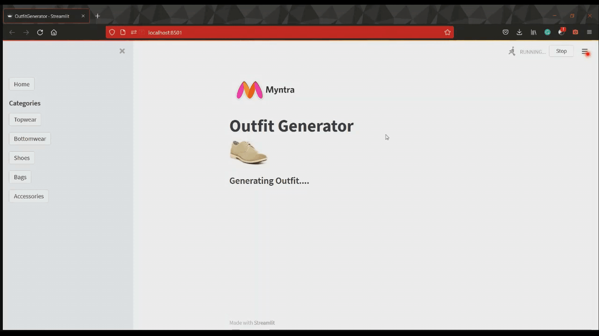

# Outfit Generator

Submission to Myntra Hackerramp: Campus Edition 2021 (*Theme: Enchance*)



## Usage

1. We use the [Polyvore](https://github.com/xthan/polyvore/) dataset. In fact we use a cleaner version of the dataset, that is available in this [repo](data).

2. Extract the [polyvore-images](https://drive.google.com/file/d/0B4Eo9mft9jwoNm5WR3ltVkJWX0k/view?resourcekey=0-U-30d1POF7IlnAE5bzOzPA) dataset into an image folder in the [data](data) directory.

3. To train or evaluate the model, go into the [model](model) directory and run `train.py` or `evaluate.py` respectively. (*to evaluate you must place the trained model in the [model](model) directory with the name **Final.pth***)

4. To run the web app, go into the [App](app) directory and use

    ```
    streamlit run OutfitGenerator.py
    ```
    to run the app on your local browser

## Pretrained Model

Download the [pretrained model](https://drive.google.com/file/d/1xw9ltUXWMSdiLrU9IpLlyN8P0nnffVjq/view?usp=sharing) and place it in the [model](model) directory to use.

## Dependencies

* pytorch
* torchvision
* scikit-learn
* matplotlib
* streamlit

